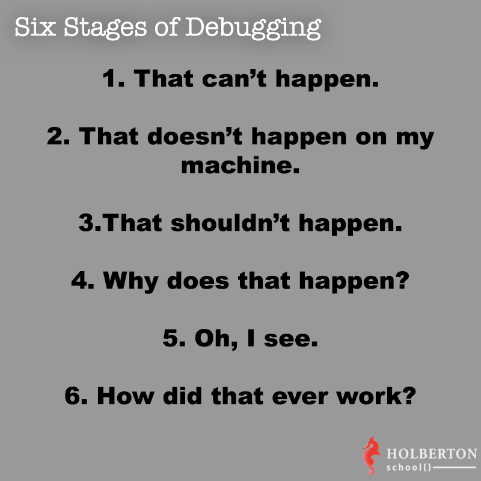

# 0x17. Web Stack Debugging #3


## Concepts
- Web Server
- Web Stack Debugging

## Background Context
Debugging often requires more than logs; sometimes, errors are not logged, or logs lack sufficient information. This project involves debugging a WordPress website running on a LAMP stack (Linux, Apache, MySQL, PHP), a popular framework that powers 26% of the web.

## Tasks
### 0. Strace is Your Friend (Mandatory)
- **Objective**: Use `strace` to identify the cause of Apache returning a 500 error, fix it, and automate the fix with Puppet.

#### Example Commands:
```bash
# Check current Apache status
curl -sI 127.0.0.1

# Apply Puppet manifest (0-strace_is_your_friend.pp)
# This file contains Puppet code to fix the Apache 500 error.
puppet apply 0-strace_is_your_friend.pp

# Verify successful fix
curl -sI 127.0.0.1:80

